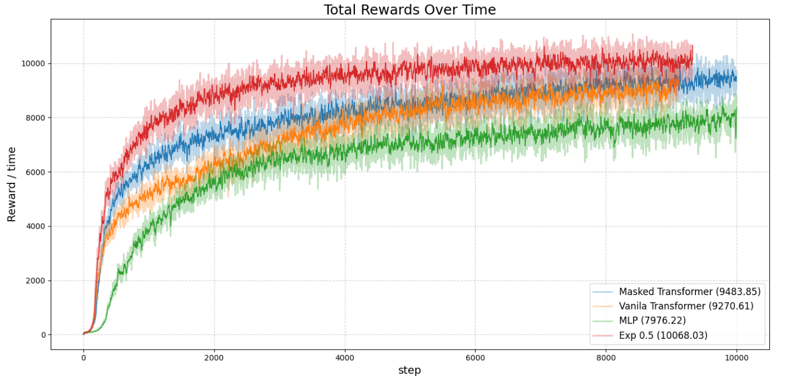

Отлично 👍 Тогда финальная версия README на английском с твоей фразой будет выглядеть так:

---

# PhysicalLocomotion

This repository is a fork of [BodyTransformer](https://github.com/real-stanford/BodyTransformer), originally implementing a graph-based masking technique for structural elements.
I extend the authors’ idea and introduce several new features:

1. **Exponentially decaying masks** — allowing more flexible attention suppression.
2. **Training & testing interface** — designed for policy learning and subsequent evaluation with full logging of intermediate attention matrices for further analysis.
3. **Custom masking based on attention analysis** — which not only speeds up computation but also improves overall quality.
For more details, please refer to the thesis text: `Bachelor_Thesis.pdf` and the presentation: `presentation.pdf`.

<p align="center">
  
</p>

<p align="center"><i>
The figure shows a comparison of four methods: MLP, Vanilla Transformer, Masked Transformer, and Exp Decay Transformer, each averaged over 5 runs.  
The Exp Decay Transformer demonstrates a clear dominance in performance, supporting the validity of the introduced inductive bias and indicating the right direction of research.
</i></p>


This repository was the foundation of my **thesis project**.
The text and presentation of my work can be found in the corresponding files inside this repo.

---

## Install the simulation environment

Install IsaacGym by following the instructions in the [official page](https://developer.nvidia.com/isaac-gym).
Then, install the required packages:
```
pip install -e IsaacGymEnvs
pip install -e rl_games
```

## Train the policy

To train the policy, run the following commands:
```
cd IsaacGymEnvs/isaacgymenvs
python launch.py
```
See the `launch.py` file for the available options.


---

## Acknowledgements

This work is based on the original [BodyTransformer](https://github.com/real-stanford/BodyTransformer).

---

## Note

This repository is still a work in progress. The research continues to achieve higher-quality results and more insightful interpretations.
